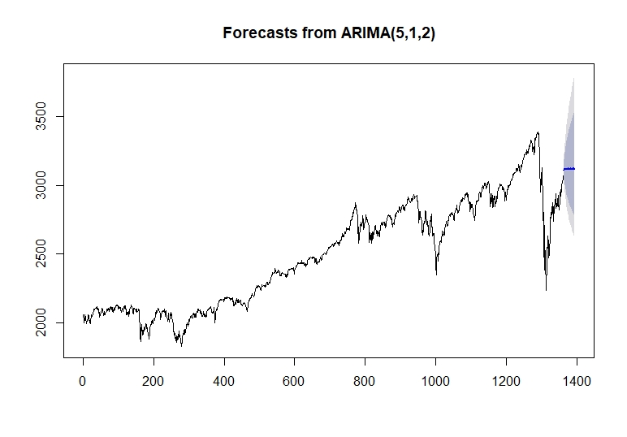
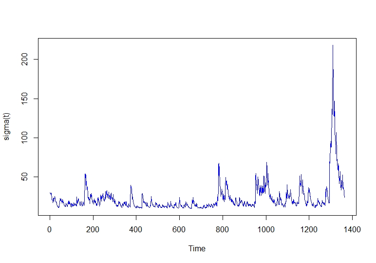
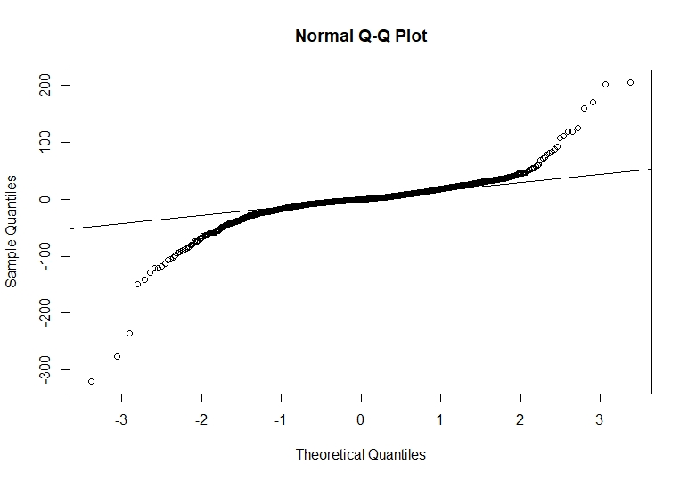

# Forcasting of a Time Series (Stock Market) Data in R
### *A Comparative Study by,* 

#### _Shreyashi Saha_ _and_ _Sagarnil Bose_
###### _Masters in Statistics_


### Contents

####  **Overview**  
  
####  **Introduction**  
  
####  **Dataset and Advanced Visualizations**  
  
####  **Methods**
 * *ARIMA*: &nbsp; *Autoregressive Integrating Moving Average Model
		   -Forecasting
		   -Arima Results*
 * *GARCH*: &nbsp; *Generalized Autoregressive Conditional Heteroscedastic Model
		   -Garch Forecasting
                   -Garch Results*
 * *Prophet-Prophet Forecasting-Prophet Results*
 * *K-NN regression time series forecasting*
 * *Feed Foward Neural network*  
 
 #### **Result**  
 
 #### **Conclusion**

### **Overview**
This project describes different time series and machine learning forecasting models applied to a real stock close price dataset. For this project we will start with a general idea of the stock price, including dataset analysis. Followed by a general description and analysis of the dataset, our objective is to apply different forecasting predictive models for “S&P500” stock daily close price. The models will be evaluated, analyzed and compared, following the main course project directions. The data will be prepared to predict the next 30 days’ close price from today. The results will be explained during the report along with concluding remarks.
### **Introduction**
A forecasting algorithm is an information process that seeks to predict future values based on past and present data. This historical data points are extracted and prepared trying to predict future values for a selected variable of the dataset. In this project approach we will focus on quantitative forecasting involving our variable to forecast (close price), its statistical analysis and advanced concepts applied to a given historical data.

Historically, there has been a continuous interest in trying to analyze market tendencies, behavior and random reactions. This continuous concern to understand what happens before it really happens motivates us to continue with this study. Some great market traders and economists says that is almost impossible to predict stock returns or prices referring to, independence between each other, the past movements or trends cannot be used to predict future values, explained by random walk theory, skewness, kurtosis and big random component. With the new different advanced models, we will try to go against the current, because, why not? As this is a data science project this forecasting models are not considered as oracles, but are really useful for analyzing the movements of stock prices with a statistical approach. The main objective of this research is to show the models fitted, compare them and encourage the use of them.

Let us firstly load the following libraries into the R environment
```R
#libraries
library(quantmod)
library(ggplot2)
library(forecast)
library(tseries)
library(rugarch)
library(prophet)
library(tsfknn)
```
If the libraries are not installed, install the required packages with `install.packages("library.name")`
### **Dataset and Advanced Visualizations**
Firstly, we take a glimpse into the data.
```R
getSymbols("^GSPC",src="yahoo",from="2015-01-01",to = "2020-06-04")
head(GSPC)
```
```
>Index        GSPC.Open   GSPC.High   GSPC.Low   GSPC.Close   GSPC.Volume   GSPC.Adjusted
 2015-01-02   2058.90     2072.36     2046.04    2058.20      2708700000    2058.20
 2015-01-05   2054.44     2054.44     2017.34    2020.58      3799120000    2020.58
 2015-01-06   2022.15     2030.25     1992.44    2002.61      4460110000    2002.61
 2015-01-07   2005.55     2029.61     2005.55    2025.90      3805480000    2025.90
 2015-01-08   2030.61     2064.08     2030.61    2062.14      3934010000    2062.14
 2015-01-09   2063.45     2064.43     2038.33    2044.81      3364140000    2044.81
```
Now, we try to visualize the close price data with the following graph
```R
chartSeries(GSPC,TA = NULL)
```


For a more advanced view, we add Bollinger Band chart, % Bollinger change, Volume Traded and Moving Average Convergence Divergence to the above graph.


For a more detailed code [visit here.](https://github.com/Stat-Wizards/Forcasting-a-Time-Series-Stock-Market-Data)

Now, for analysing the above Moving Average Convergence Divergence graph we would require a little knowlegde of the Trading Vocabularies and some empirical methods of understanding the close price data. So what is MACD ?

##### **Moving Average Convergence Divergence (MACD)**:
Moving Average Convergence Divergence (MACD) is a trend-following momentum indicator that shows the relationship between two moving averages of a security’s price. The MACD is calculated by subtracting the 26-period Exponential Moving Average (EMA) from the 12-period EMA.

##### **Formula**: 
MACD=12-Period EMA − 26-Period EMA

##### Now, We do understand your fraustration with us, explaining a jargon with another but please do bear with us for just a moment. &nbsp; **So what is EMA ?**

An exponential moving average (EMA) is a type of moving average (MA) that places a greater weight and significance on the most recent data points. The exponential moving average is also referred to as the exponentially weighted moving average. An exponentially weighted moving average reacts more significantly to recent price changes than a simple moving average (SMA), which applies an equal weight to all observations in the period.

The result of that calculation is the MACD line. A nine-day EMA of the MACD called the "signal line," is then plotted on top of the MACD line, which can function as a trigger for buy and sell signals. Traders may buy the security when the MACD crosses above its signal line and sell - or short - the security when the MACD crosses below the signal line. Moving Average Convergence Divergence (MACD) indicators can be interpreted in several ways, but the more common methods are crossovers, divergences, and rapid rises/falls.

##### So why do you need to know about MACD ?
* Moving Average Convergence Divergence (MACD) is calculated by subtracting the 26-period exponential moving average (EMA) from the 12-period EMA.
* MACD triggers technical signals when it crosses above (to buy) or below (to sell) its signal line.
* The speed of crossovers is also taken as a signal of a market is overbought or oversold.
* Traders use the MACD to identify when bullish (↑) or bearish (↓) momentum is high in order to identify entry and exit points for trades.
* MACD is used by technical traders in stocks, bonds, commodities and FX markets 

##### Learning from MACD :
The MACD has a positive value whenever the 12-period EMA (blue) is above the 26-period EMA (red) and a negative value when the 12-period EMA is below the 26-period EMA. The more distant the MACD is above or below its baseline indicates that the distance between the two EMAs is growing. MACD is often displayed with a histogram (see the chart below) which graphs the distance between the MACD and its signal line. If the MACD is above the signal line, the histogram will be above the MACD’s baseline. If the MACD is below its signal line, the histogram will be below the MACD’s baseline. Traders use the MACD’s histogram to identify when bullish or bearish momentum is high.

##### Limitations :
One of the main problems with divergence is that it can often signal a possible reversal but then no actual reversal actually happens – it produces a false positive. The other problem is that divergence doesn't forecast all reversals. In other words, it predicts too many reversals that don't occur and not enough real price reversals.

##### Now, enough of technical trading and empirical understanding of the data. Lets do some Statistricks already.
##### Obviously, we start with a Classical one, Machine Learning can wait okay?

### **Methods**

##### Arima : Autoregressive Integrating Moving Average

ARIMA stands for Autoregressive Integrated Moving Average. ARIMA is also known as Box-Jenkins approach. Box and Jenkins claimed that non-stationary data can be made stationary by differencing the series, Y<sub>t</sub>. The general model for Y<sub>t</sub> is written as,









