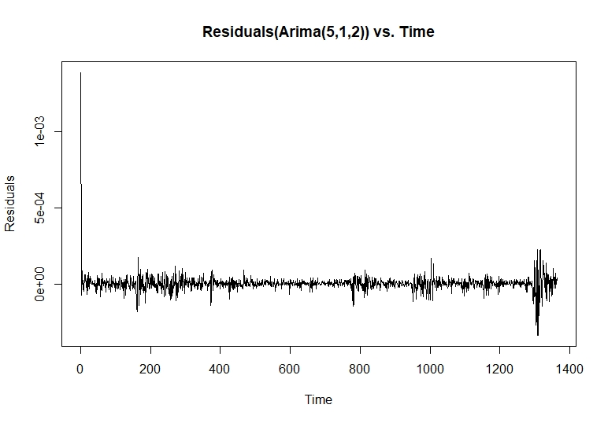
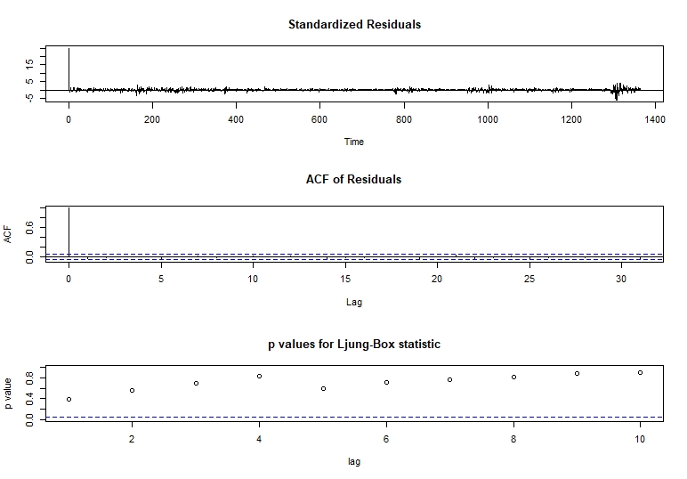
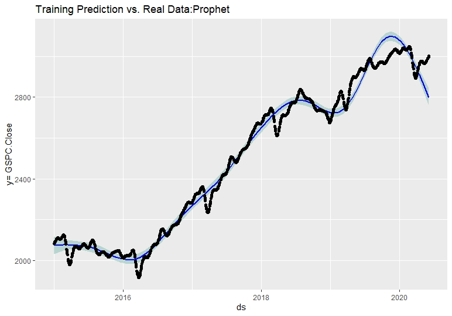
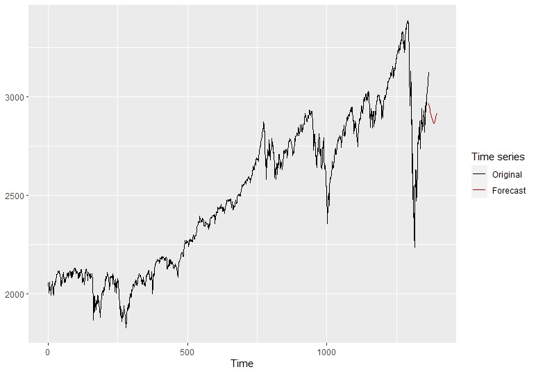

# Forcasting of a Time Series (Stock Market) Data in R
### *A Comparative Study by,* 

#### _Shreyashi Saha_ _and_ _Sagarnil Bose_
###### _Masters in Statistics_


### Contents

####  **Overview**  
  
####  **Introduction**  
  
####  **Dataset and Advanced Visualizations**  
  
####  **Methods**
 * *ARIMA*: &nbsp; *Autoregressive Integrating Moving Average Model
		   -Forecasting
		   -Arima Results*
 * *GARCH*: &nbsp; *Generalized Autoregressive Conditional Heteroscedastic Model
		   -Garch Forecasting
                   -Garch Results*
 * *Prophet-Prophet Forecasting-Prophet Results*
 * *K-NN regression time series forecasting*
 * *Feed Foward Neural network*  
 
 #### **Result**  
 
 #### **Conclusion**

### **Overview**
This project describes different time series and machine learning forecasting models applied to a real stock close price dataset. For this project we will start with a general idea of the stock price, including dataset analysis. Followed by a general description and analysis of the dataset, our objective is to apply different forecasting predictive models for “S&P500” stock daily close price. The models will be evaluated, analyzed and compared, following the main course project directions. The data will be prepared to predict the next 30 days’ close price from today. The results will be explained during the report along with concluding remarks.
### **Introduction**
A forecasting algorithm is an information process that seeks to predict future values based on past and present data. This historical data points are extracted and prepared trying to predict future values for a selected variable of the dataset. In this project approach we will focus on quantitative forecasting involving our variable to forecast (close price), its statistical analysis and advanced concepts applied to a given historical data.

Historically, there has been a continuous interest in trying to analyze market tendencies, behavior and random reactions. This continuous concern to understand what happens before it really happens motivates us to continue with this study. Some great market traders and economists says that is almost impossible to predict stock returns or prices referring to, independence between each other, the past movements or trends cannot be used to predict future values, explained by random walk theory, skewness, kurtosis and big random component. With the new different advanced models, we will try to go against the current, because, why not? As this is a data science project this forecasting models are not considered as oracles, but are really useful for analyzing the movements of stock prices with a statistical approach. The main objective of this research is to show the models fitted, compare them and encourage the use of them.

Let us firstly load the following libraries into the R environment
```R
#libraries
library(quantmod)
library(ggplot2)
library(forecast)
library(tseries)
library(rugarch)
library(prophet)
library(tsfknn)
```
If the libraries are not installed, install the required packages with `install.packages("library.name")`
### **Dataset and Advanced Visualizations**
Firstly, we take a glimpse into the data.
```R
getSymbols("^GSPC",src="yahoo",from="2015-01-01",to = "2020-06-04")
head(GSPC)
```
```
# Index        GSPC.Open   GSPC.High   GSPC.Low   GSPC.Close   GSPC.Volume   GSPC.Adjusted
# 2015-01-02   2058.90     2072.36     2046.04    2058.20      2708700000    2058.20
# 2015-01-05   2054.44     2054.44     2017.34    2020.58      3799120000    2020.58
# 2015-01-06   2022.15     2030.25     1992.44    2002.61      4460110000    2002.61
# 2015-01-07   2005.55     2029.61     2005.55    2025.90      3805480000    2025.90
# 2015-01-08   2030.61     2064.08     2030.61    2062.14      3934010000    2062.14
# 2015-01-09   2063.45     2064.43     2038.33    2044.81      3364140000    2044.81
```
Now, we try to visualize the close price data with the following graph
```R
chartSeries(GSPC,TA = NULL)
```


For a more advanced view, we add Bollinger Band chart, % Bollinger change, Volume Traded and Moving Average Convergence Divergence to the above graph.


For a more detailed code [visit here.](https://github.com/Stat-Wizards/Forcasting-a-Time-Series-Stock-Market-Data)

Now, for analysing the above Moving Average Convergence Divergence graph we would require a little knowlegde of the Trading Vocabularies and some empirical methods of understanding the close price data. So what is MACD ?

##### **Moving Average Convergence Divergence (MACD)**:
Moving Average Convergence Divergence (MACD) is a trend-following momentum indicator that shows the relationship between two moving averages of a security’s price. The MACD is calculated by subtracting the 26-period Exponential Moving Average (EMA) from the 12-period EMA.

##### **Formula**: 
MACD=12-Period EMA − 26-Period EMA

##### Now, We do understand your fraustration with us, explaining a jargon with another but please do bear with us for just a moment. &nbsp; **So what is EMA ?**

An exponential moving average (EMA) is a type of moving average (MA) that places a greater weight and significance on the most recent data points. The exponential moving average is also referred to as the exponentially weighted moving average. An exponentially weighted moving average reacts more significantly to recent price changes than a simple moving average (SMA), which applies an equal weight to all observations in the period.

The result of that calculation is the MACD line. A nine-day EMA of the MACD called the "signal line," is then plotted on top of the MACD line, which can function as a trigger for buy and sell signals. Traders may buy the security when the MACD crosses above its signal line and sell - or short - the security when the MACD crosses below the signal line. Moving Average Convergence Divergence (MACD) indicators can be interpreted in several ways, but the more common methods are crossovers, divergences, and rapid rises/falls.

##### So why do you need to know about MACD ?
* Moving Average Convergence Divergence (MACD) is calculated by subtracting the 26-period exponential moving average (EMA) from the 12-period EMA.
* MACD triggers technical signals when it crosses above (to buy) or below (to sell) its signal line.
* The speed of crossovers is also taken as a signal of a market is overbought or oversold.
* Traders use the MACD to identify when bullish (↑) or bearish (↓) momentum is high in order to identify entry and exit points for trades.
* MACD is used by technical traders in stocks, bonds, commodities and FX markets 

##### Learning from MACD :
The MACD has a positive value whenever the 12-period EMA (blue) is above the 26-period EMA (red) and a negative value when the 12-period EMA is below the 26-period EMA. The more distant the MACD is above or below its baseline indicates that the distance between the two EMAs is growing. MACD is often displayed with a histogram (see the chart below) which graphs the distance between the MACD and its signal line. If the MACD is above the signal line, the histogram will be above the MACD’s baseline. If the MACD is below its signal line, the histogram will be below the MACD’s baseline. Traders use the MACD’s histogram to identify when bullish or bearish momentum is high.

##### Limitations :
One of the main problems with divergence is that it can often signal a possible reversal but then no actual reversal actually happens – it produces a false positive. The other problem is that divergence doesn't forecast all reversals. In other words, it predicts too many reversals that don't occur and not enough real price reversals.

##### Now, enough of technical trading and empirical understanding of the data. Lets do some Statistricks already.
##### Obviously, we start with a Classical one, Machine Learning can wait okay?

### **Methods**

##### Arima : Autoregressive Integrating Moving Average

ARIMA stands for Autoregressive Integrated Moving Average. ARIMA is also known as Box-Jenkins approach. Box and Jenkins claimed that non-stationary data can be made stationary by differencing the series, Y<sub>t</sub>. The general model for Y<sub>t</sub> is written as,


Or,  

Where, Y<sub>t</sub> is the differenced time series value, ϕ and θ are unknown parameters and e are independent identically distributed error terms with zero mean. Here, Y<sub>t</sub> is expressed in terms of its past values and the current and past values of error terms.

The ARIMA model combines three basic methods:

* **Auto Regression (AR)**: In auto-regression the values of a given time series data are regressed on their own lagged values, which is indicated by the “p” value in the model.
* **Differencing (I for Integrated)**: This involves differencing the time series data to remove the trend and convert a non-stationary time series to a stationary one. This is indicated by the “d” value in the model. If d = 1, it looks at the difference between two time-series entries, if d = 2 it looks at the differences of the differences obtained at d =1, and so forth.
* **Moving Average (MA)**: The MA nature of the model is represented by q values which is the number of lagged values of the error term.

This model is called Autoregressive Integrated Moving Average or ARIMA (p, d, q) of Yt.  We will follow the steps enumerated below to build our model.

**Step 1: Testing and Ensuring Stationarity**

To model a time series with the Box-Jenkins approach, the series has to be stationary. A stationary time series means a time series without trend, one having a constant mean and variance over time, which makes it easy for predicting values.

Testing for stationarity – We test for stationarity using the Augmented Dickey-Fuller unit root test. The p-value resulting from the ADF test has to be less than 0.05 or 5% for a time series to be stationary. If the p-value is greater than 0.05 or 5%, you conclude that the time series has a unit root which means that it is a non-stationary process.

Differencing – To convert a non-stationary process to a stationary process, we apply the differencing method. Differencing a time series means finding the differences between consecutive values of a time series data. The differenced values form a new time series dataset which can be tested to uncover new correlations or other interesting statistical properties.

We can apply the differencing method consecutively more than once, giving rise to the “first differences”, “second order differences”, etc.
We apply the appropriate differencing order (d) to make a time series stationary before we can proceed to the next step.

**Step 2: Identification of p and q**

In this step, we identify the appropriate order of Autoregressive (AR) and Moving average (MA) processes by using the Autocorrelation function (ACF) and Partial Autocorrelation function (PACF).

Identifying the p order of AR model
For AR models, the ACF will dampen exponentially and the PACF will be used to identify the order (p) of the AR model. If we have one significant spike at lag 1 on the PACF, then we have an AR model of the order 1, i.e. AR (1). If we have significant spikes at lag 1, 2, and 3 on the PACF, then we have an AR model of the order 3, i.e. AR (3).

Identifying the q order of MA model
For MA models, the PACF will dampen exponentially and the ACF plot will be used to identify the order of the MA process. If we have one significant spike at lag 1 on the ACF, then we have an MA model of the order 1, i.e. MA (1). If we have significant spikes at lag 1, 2, and 3 on the ACF, then we have an MA model of the order 3, i.e. MA (3).

**Step 3: Estimation and Forecasting**

Once we have determined the parameters (p, d, q) we estimate the accuracy of the ARIMA model on a training data set and then use the fitted model to forecast the values of the test data set using a forecasting function. In the end, we cross check whether our forecasted values are in line with the actual values.

First we conduct an ADF test for the close price set:
```R
## ADF Test
print(adf.test(GSPC$GSPC.Close))
```
```R
# Augmented Dickey-Fuller Test
#  data:  GSPC$GSPC.Close
#  Dickey-Fuller = -4.2322, Lag order = 11, p-value = 0.01
#  alternative hypothesis: stationary
```

After the ADF test we apply ACF (Autocorrelation function) and PACF (Partial autocorrelation function) functions to the dataset.
```R
## Plot ACF and PACF

par(mfrow = c(1, 2))
acf(GSPC$GSPC.Close)
pacf(GSPC$GSPC.Close)
par(mfrow = c(1, 1))

#dev.off()
```


Autocorrelation refers to how correlated a time series is with is past values. As we know in AR models the ACF will dampen exponentially. The ACF is the plot used to see the correlation between the points, up to and including the lag units. We can see that the autocorrelation is significant for large number of lags, but perhaps the autocorrelation at posterior lags are merely due to propagation of autocorrelation at the first lags.

We use ACF and PACF plot to identify the (q) order and the PACF will dampen exponentially. If we can note that it is a significant spike only at first lags, means that all the higher order autocorrelation is effectively explained by the first lag autocorrelation.

Now, we fit our model to the price data.
```R
## Applying auto.arima() to the dataset 
modelfit <-auto.arima(GSPC$GSPC.Close, lambda = "auto")
summary(modelfit)
```

We can see our model factors now.

```R
# Series: GSPC$GSPC.Close 

# ARIMA(5,1,2) 

# Box Cox transformation: lambda= -0.7182431 

# Coefficients:

#           ar1      ar2     ar3     ar4     ar5     ma1     ma2
#       -1.6503  -0.8038  0.0364  0.0502  0.0434  1.5262  0.6656

# s.e.   0.0863   0.0944  0.0569  0.0545  0.0362  0.0825  0.0692

# sigma^2 estimated as 3.071e-09:  log likelihood=11849.61

# AIC=-23683.23   AICc=-23683.12   BIC=-23641.49

# Training set error measures:

#                    ME     RMSE      MAE        MPE      MAPE     MASE        ACF1
# Training set 1.211636 31.65724 17.56103 0.04474109 0.7083487 1.016037 -0.02548426
```
With our model summary we can check the residuals of the model with ARIMA parameters selected

```R
# Diagnostics on Residuals
plot(resid(modelfit),ylab="Residuals",main="Residuals(Arima(5,1,2)) vs. Time")
```


The “residuals” in a time series model are what is left over after fitting a model. In majority of time series models, the residuals are equal to the difference between the observations and the fitted values:

 &nbsp; &nbsp; &nbsp; 
 
 As we did some correlation tests to our dataset, we now check our residuals over a normal curve.
 ```R
# Histogram of Residuals & Normality Assumption
hist(resid(modelfit),freq=F,ylim=c(0,9500),main="Histogram of Residuals")
e=resid(modelfit)
curve(dnorm(x, mean=mean(e), sd=sd(e)), add=TRUE, col="darkred")
 ```


As we can see, the residuals plot has a descent normal curve adjustment, giving us a good point to continue this study. Now we can make our last residuals plot, giving us the standardized residuals, ACF of residuals and p-values for Ljung-Box statistic plots.

```R
# Diagnostics tests for Arima
tsdiag(modelfit)
```


With this 3 graphs we focus on the Ljung-Box p-values. For the Ljung-Box test we have that our null hypothesis is:

H<sub>θ</sub>: The dataset points are independently distributed.

With this null hypothesis, a significant p-value greater than 0.05 does not rejects the fact that the dataset points are not correlated.

In the previous p-values Ljung-Box plot, we can see that in lag 1 we have a smaller p-value. Given this visual inspection we proceed to analyze this lag with an independent test.
```R
# Box test for lag=2
Box.test(modelfit$residuals, lag= 2, type="Ljung-Box")
```
```R
# Box-Ljung test
# data:  modelfit$residuals
# X-squared = 1.1885, df = 2, p-value = 0.552
```
As we can see our p-value still not rejects our null hypothesis, allowing us to make a generalized box test.

```R
Box.test(modelfit$residuals, type="Ljung-Box")
```
```R
# Box-Ljung test
# data:  modelfit$residuals
# X-squared = 0.76978, df = 1, p-value = 0.3803
```
In this generalized test we can see that our null hypothesis is still not rejected, allowing us to continue our study with a solid motivation.

Having our new ARIMA model applied and analyzed we can plot the model prediction in a red line over the real train set stock close price.

```R
plot(as.ts(GSPC$GSPC.Close))
lines(modelfit$fitted,col="red")
```


**Arima Results**  

Now with the model fitted we can proceed to forecast our daily close price values to the future. We focus on forecasting the close stock price for the next 30 days or an average month.  

We can now plot our forecast for the next 30 days.

```R
plot(forecast(modelfit,h=30))
```


As we can see, we have a blue line that represents the mean of our prediction.

```R
price_forecast <- forecast(modelfit,h=30)
plot(price_forecast)
head(price_forecast$mean)
```
```R
# Time Series:
#  Start = 1365 
#  End = 1370 
#  Frequency = 1 
#  [1] 3113.484 3120.944 3119.524 3118.773 3122.801 3116.676
```

With the blue line explained we can see a darker and light darker areas, representing 80% and 95% confidence intervals respectively in lower and upper scenarios.

Our lower scenario:
```R
# Time Series:
# Start = 1365 
# End = 1370 
# Frequency = 1 
#           80%      95%
# 1365 3043.480 3007.509
# 1366 3028.100 2980.854
# 1367 3006.451 2949.411
# 1368 2987.954 2922.467
# 1369 2977.728 2905.546
# 1370 2956.716 2877.652
```
Our Upper scenario:
```R
# Time Series:
# Start = 1365 
# End = 1370 
# Frequency = 1 
#           80%      95%
# 1365 3186.300 3226.041
# 1366 3218.789 3272.741
# 1367 3240.106 3307.223
# 1368 3259.752 3338.883
# 1369 3280.459 3369.550
# 1370 3292.106 3391.974
```
For a more detailed code [visit here.](https://github.com/Stat-Wizards/Forcasting-a-Time-Series-Stock-Market-Data)








